# Quiz Pro Quo

Find the final project here: [Quiz Pro Quo](https://irebernardidev.github.io/Quiz-Pro-Quo/)

## Table of Contents
- [Introduction](#introduction)
- [UX](#ux)
   * [User Stories](#user-stories)
- [Design](#design)
  * [Colour Scheme](#colour-scheme)
  * [Typography](#typography)
  * [Imagery](#imagery)
  * [Wireframes](#wireframes)
  * [Features](#features)
    * [The Home Page](#the-home-page)
    * [The Game Page](#the-game-page)
    * [The Leaderboard Page](#the-leaderboard-page)
    * [The Contact Page](#the-contact-page)
    * [The 404 Error Page](#the-404-error-page)
    * [The 500 Error Page](#the-500-error-page)
    * [Features to Implement in the Future](#features-to-implement-in-the-future)
  * [Accessibility](#accessibility)  
- [Issues and Bugs](#issues-and-bugs)
- [Technologies Used](#technologies-used)
  * [Main Languages Used](#main-languages-used)
  * [Frameworks, Libraries & Programs Used](#frameworks-libraries--programs-used)
- [Testing](#testing)
  * [TESTING.md](#TESTING.md)
- [Deployment](#deployment)
  * [Deploying on GitHub Pages](#deploying-on-github-pages)
  * [Cloning the repository](#cloning-the-repository)
  * [Forking the repository](#forking-the-repository)
- [Credits](#credits)
  * [Content](#content)
  * [Media](#media)
  * [Code](#code)
- [Acknowledgements](#acknowledgements)

## Introduction
Welcome to the Quiz Pro Quo repository! Dive into an interactive quiz experience that tests your knowledge on pop culture, from trending music hits to iconic movies throughout the decades. Built with the pillars of web development - HTML, CSS, and JavaScript - this project offers a seamless and engaging quiz interface fit for both casual pub goers and trivia enthusiasts alike.
Whether you're looking to host a fun evening with friends, or simply challenge your own knowledge on pop culture, the Pop Pub Quiz is the perfect web-based trivia game for you. Dive in, have fun, and may the best pop culture aficionado win!

This website was made for the second of four Milestone projects required to complete the Diploma in Software development program at The Code Institute.
## User Experience
### User Stories

#### First Time Visitor Goals
- When I land on the Quiz Pro Quo homepage, I want to take part in a trivia quiz online and improve my general knowledge. I want to be able to play at any time, anywhere.
- I want the site to be responsive to my device.
- I want the site to be easy to navigate.

#### Returning Visitor Goals
- I want to be able to choose a level of difficulty that I feel is appropriate for me, based on my experience from my first visit to the site.

#### Frequent User Goals
- I want to be able to adjust the difficulty level to keep improving my knowledge.
- I want to be able to log my high scores to see how I am performing.

  
Click to see Persona Forms!

  
  
  

# Design
Quiz Pro Quo is designed to be visually engaging, intuitive, and user-friendly, ensuring a seamless and immersive gaming experience. The design is centered around an aesthetic that's appealing and enjoyable, while also aiding the functionality of the quiz game.
The following design elements were used in the website:

- ## Colour Scheme
The color scheme adopted for this application provides a balance between attractiveness and functionality.

- Primary Color (#a881af): This muted purple tone is used extensively throughout the application to provide a calming effect and to maintain a consistent visual identity. It is used in areas such as headers, footers, buttons, and borders.

- Accent Color (#5adbb5): This light teal color is utilized for accenting and highlighting certain elements of the UI such as button hover effects and correct choices, providing a lively contrast to the primary color.

- Background Color (rgba(255, 255, 255, 0.5)): A slightly transparent white is used as the background color for containers, ensuring readability while maintaining a light and airy aesthetic.

- Error Color (#FFCDD2): A soft red color is utilized to signify incorrect choices, offering an intuitive visual cue to the user.

- Success Color (#C8E6C9): A light green color is used to indicate correct answers, signaling success in an intuitive manner.

## Colour Palette
Using the [Adobe Color](https://color.adobe.com/create/color-wheel) colour wheel

- ## Typography

• Primary Font: [Roboto](https://fonts.google.com/specimen/Roboto) - The Roboto font is used for all text on the website. This font was chosen for its clean lines and readability, which complement the straightforward, accessible design of the website.

• Secondary Font: [Font Awesome](https://fontawesome.com/) - Font Awesome icons are used throughout the website to enhance the user interface.

- ## Imagery
The Quiz Pro Quo website primarily relies on a text-based interface to create a distraction-free quiz environment. However, some key images and icons are used:
  * Logo: The Quiz Pro Quo logo from [Flaming Text](https://flamingtext.com/) is displayed prominently on the top of each page. It has been designed to reflect the fun and exciting nature of the quizzes. The alt attribute is set as "logo" which provides alternative information for an image if a user for some reason cannot view it.

  * Icons: [Font Awesome](https://fontawesome.com/) icons are used to visually communicate functions like social media links and volume control. They are displayed in the website's primary color for consistency.

  * [Favicon](https://www.favicon.cc/): A unique favicon is provided that is representative of the brand identity. It's visible in the browser tab for easy site identification.

## Wireframes
Wireframes were created for mobile, tablet and desktop using [Balsamiq](https://balsamiq.com/).

[Wireframes](documentation/wireframes)

# Features
## Existing Features

The website is comprised of a home page, a games page, a leaderboard page, a contact form page a 404 error page & a 500 error page.

All Pages on the website are responsive and have:
- A [favicon](https://www.favicon.cc/) in the browser tab.

- The title of the site at the top of every page. This title also acts as a link back to the home page.

- Social Media Icons:
Appearing on every page, the icons are appropriate representations of the Social Media platforms, linking users to the various platforms. The icons appear in the centre of the footer.

- The background image is an essential aspect of the website's visual aesthetic. It contributes to the overall look and feel of the site, giving it a playful and engaging appearance that fits the trivia game theme.

### The Home Page
The home page of Quiz Pro Quo displays the sites name as a title and then a container which holds some welcome text, including alerting the users that they can navigate back to the home page at any time by clicking on the page name. Below this are four buttons, Game Rules, Play, Leaderboard and Reach Out.
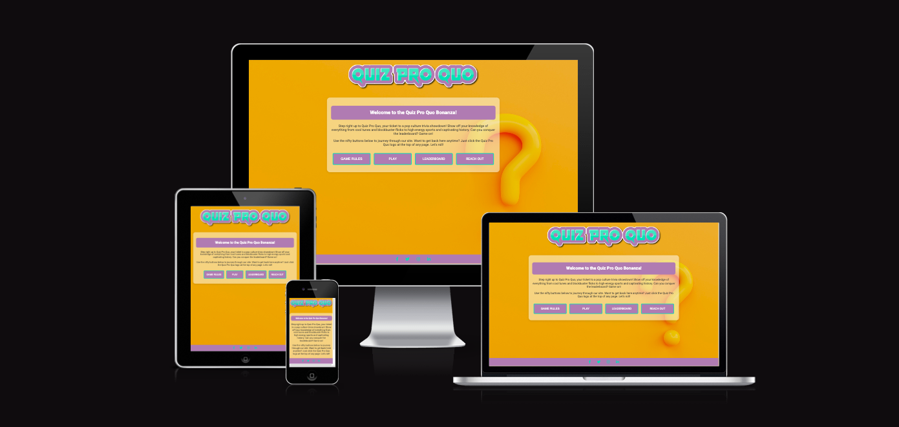

The Game Rules button opens a modal showing the user how to play. The modal contains a close button which will close the modal, and show the home page again.
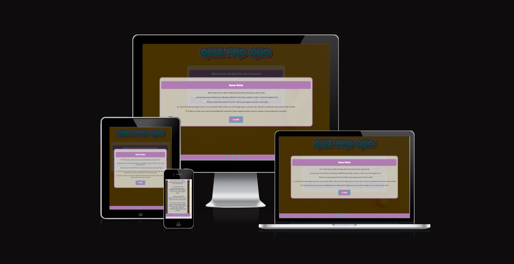

The Play button will redirect the user to the game page to select the difficulty, category, number of questions and timer lenght of their quiz, the Leaderbord button redirects the user to the Leaderboard page and the Reach Out button will redirect the user to a Contact page.

### The Game Page
Players can customize their experience by choosing the number of questions, difficulty, category and timer lenght. 
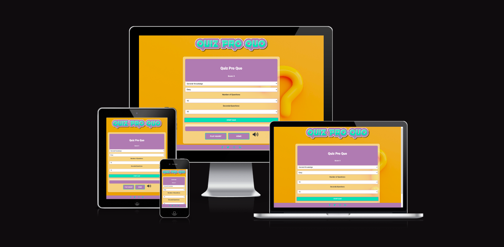

Once the quiz starts, they are timed per question and must answer within the stipulated time. With each correct answer, a point is added to their score. The game gives instant feedback on the correctness of their choices.
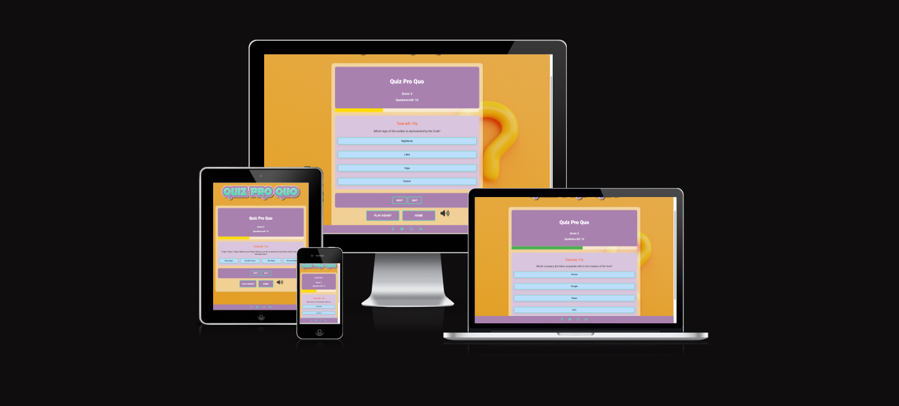

End your game with your score and a motivating message based on your performance. Players can then restart the game or go back to Home page.
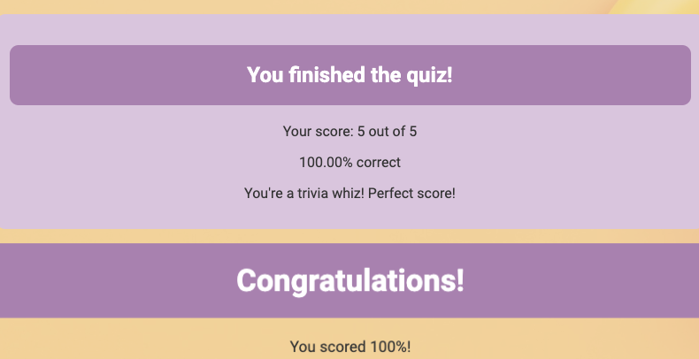

### The Leaderboard Page
The leaderboard page of Quiz Pro Quo displays a sorted list of players and their scores. Players are ranked according to their score, with the time of completion serving as a tie-breaker. It also provides a 'Play Again?' button to redirect the user to the game page, and a 'Home' button to return to the home page.
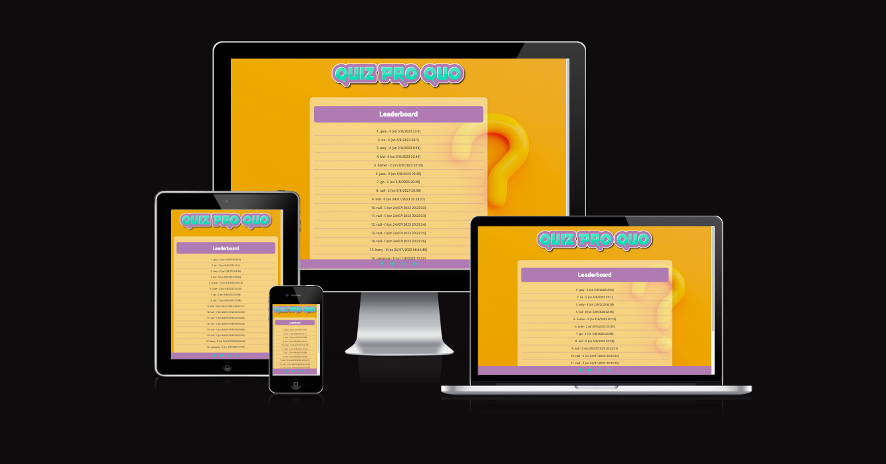
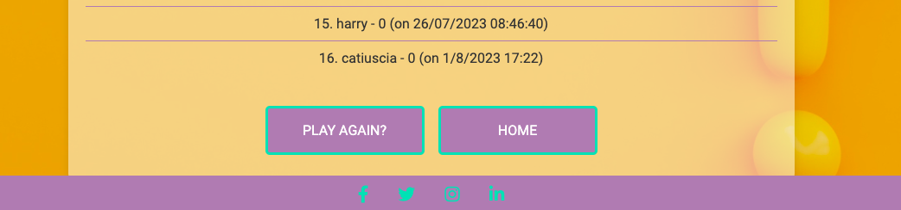

### The Contact Page
The contact page provides users with an interface to send messages directly through the website. The form captures the user's name, email, and their message. Upon submission, it sends the message to the designated recipient and provides an auto-reply to the user.
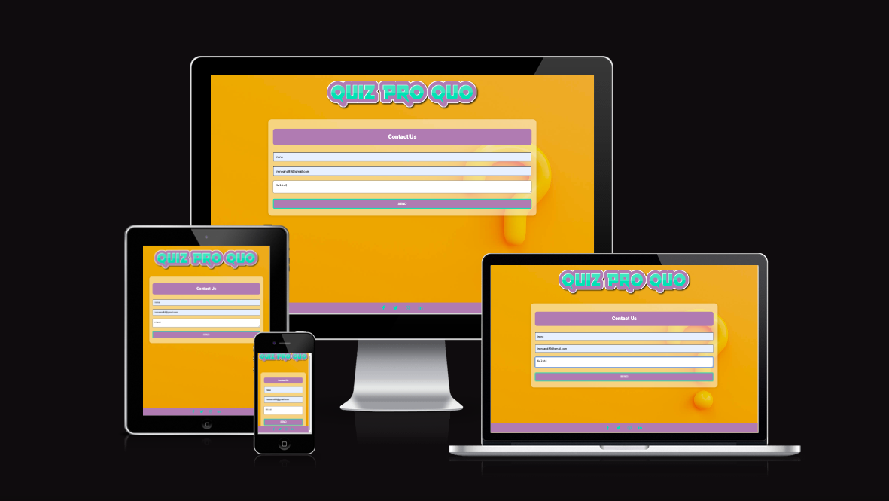

Upon submitting the form, an email will be sent to the designated recipient via [EmailJS](https://www.emailjs.com/), a service that helps send emails using client side technologies only.
This is handled by the following JavaScript code:
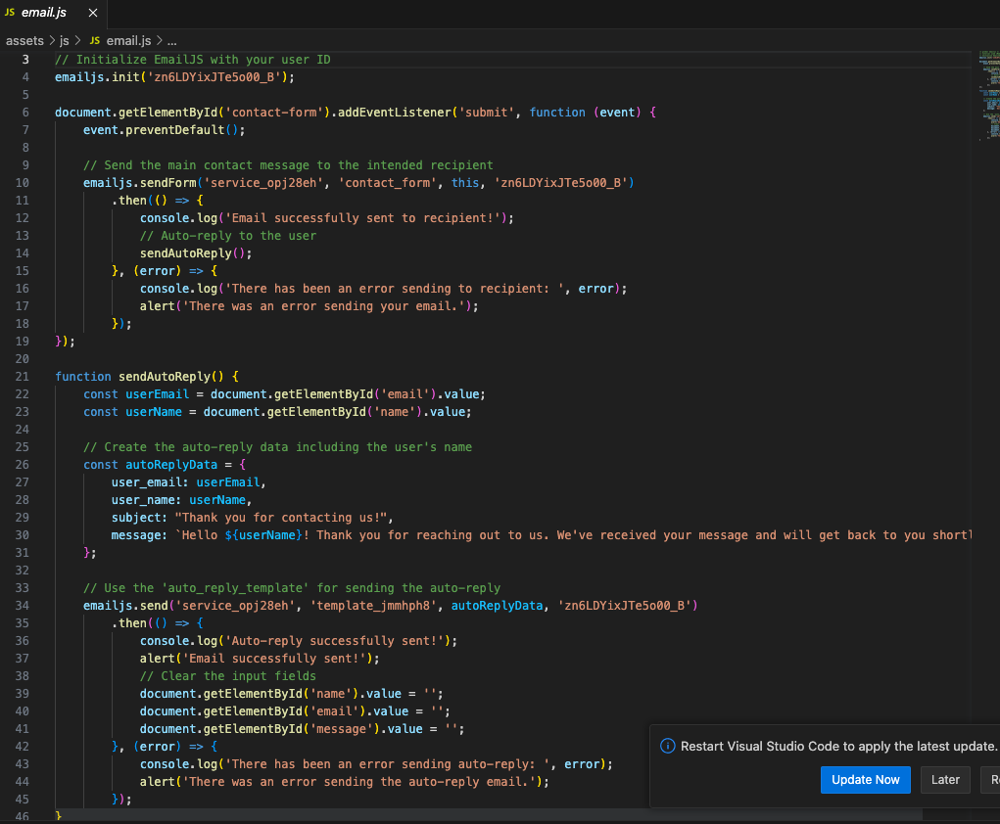

This section integrates EmailJS to send emails and is divided into multiple parts:

1.  Initialization:
  * EmailJS is initialized with a unique user ID.
2. Main Contact Email:
  * An event listener is attached to the contact form. When the form is submitted:

    2.1. Default form submission behavior is prevented.

    2.2. An email is sent to the intended recipient using the details from the form.

    2.3. Upon successful email sending, an auto-reply function is triggered to notify the user. If there's an error, the user is alerted.

3. Auto-reply Email:

  * This function sends a thank you message to the user once they've submitted the contact form.
  * User's email and name are retrieved from the form.
  * A message template is prepared with the user's name, thanking them for reaching out and ensuring a follow-up.
  * An email is sent using EmailJS, and if successful, an alert confirms the action. The form fields are then cleared for better user experience. Any errors during the process result in an error alert to the user.

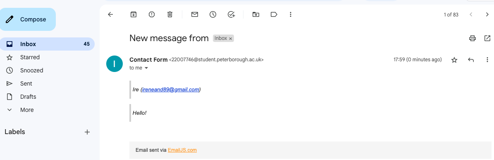

Lastly, the form fields are cleared out in preparation for the next message.

### The 404 Error Page
The 404 error page displays the sites name as a title. This also acts as a link back to the home page. Within the page there is a sorry message explaining to the user that there has been an error directing them to the page they were looking for. The user can click on Home button or title to redirect themselves to the home page.

### The 500 Error Page
The 500 error page displays the sites names as a title, which also acts as a link back to the home page. Within the page is an error message that tells the user sorry there seems to be an internal server error. The user can click on Home button or title to redirect themselves to the home page.
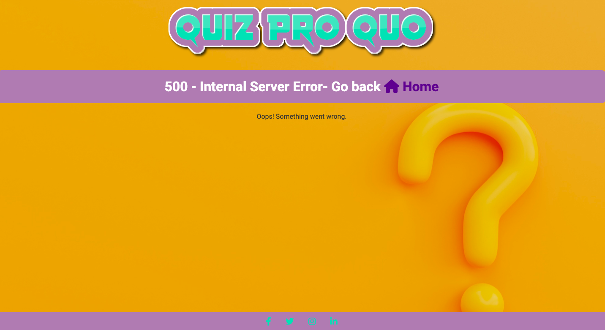

## Features to Implement in the future
- Additional features that could be added to the website in the future include:
   * Look into making the quiz a multiplayer game, so that it could be played by teams, which would make the quiz even more dynamic.
   * Create a back end database to enable me to store scores which would then allow you to see how you scored against other players.
   * Look further into the accessibility for people with colour blindness, perhaps by adding symbols such as a tick or cross next to the answer when they are checked.

## Accessibility
Throughout coding this site I kept accessibility in mind, to ensure that the website is user friendly for any user. I did this by:

  * Using semantic HTML.
  * Using descriptive aria labels for all links.
  * Providing information for screen readers when using icons - such as footer icons.

[Back to top](#)

## Issues and Bugs
The developer ran into several issues during the development of the website, with the noteworthy ones listed below:
| No | Bug | How I solved the issue|
| --------- | ---------------- | -------------- |
| 1   | The game is not successfully saving the user's name and score and transitioning to the leaderboard page. The error message "Uncaught SyntaxError: Illegal return statement" .           |   for storing multiple scores and names, I used an array of objects in localStorage instead of just a single object, then in leaderboard.js file, I retrieved the scores from localStorage and displayed them.  |
| 2    |Congrats music isn't playing when player scores 100%        |  Found two instances of the audio tag with the same id "congrats-music" in the HTML code, bug fixed after removing one.         |
| 3    | Buttons display with different sizes and not responsive      | Fixed the bug using Flexbox and I used percentages to specify the button widths, which can help with fluid layouts         |
| 4   | The Questions being pulled in from the JSON have HTML entity characters that are not escaped and therefore display incorrectly with symbols in place of the correct characters.      | Learnt that JSON does not support HTML character entities; it uses its own set of escape sequences. The HTML entities need to be converted back to their equivalent normal characters before being stored in JSON. Fixed bug using innerHTML rather than innerText. |
| 5   | There is a a warning displaying in the console on the live page. This error seems to be because GitHub hosted pages disable googles 3rd party cookie alternative FLoC, which then throws this error. The error doesn't affect the site in any way. | This bug is still present.

## Technologies Used

The following technologies were used in the development of the website:

### Main Languages Used
- HTML5
- CSS3
- JS 

### Frameworks, Libraries & Programs Used
- [Bootstrap 5.3.0](https://getbootstrap.com/) was used multiple times during the development of the project.
- [Balsamiq](https://balsamiq.com/) was used to create the wireframes during the design phase of the project.
- [GitHub](https://github.com/) was used to store the project after pushing.
- [Google Fonts](https://fonts.google.com/) was used to import the font "Roboto" into the style.css file. This font was used throughout the project.
- [Font Awesome 6.3.0](https://fontawesome.com/) was used on all pages throughout the website to import icons (e.g. social media icons) for UX purposes.
- [jQuery](https://jquery.com/) A JavaScript library.
- [Open Trivia DataBase](https://opentdb.com/) API used for the trivia questions.
- [Am I Responsive?](https://ui.dev/amiresponsive) was used in order to see responsive design throughout the process and to generate mockup imagery to be used.
- [Favicon](https://www.favicon.cc/) was used to create a favicon to help users quickly identify a website when multiple tabs are open or when searching through bookmarks.
- [Visual Studio Code](https://code.visualstudio.com/download) was used to create files pages and produce the code for the project.
- [Google Chrome Dev Tools](https://developer.chrome.com/docs/devtools/) was used during the testing phase to test the responsiveness of the site and to check for any bugs.

# Testing
The website was tested thoroughly to ensure it is fully functional and user-friendly. The testing phase involved manual testing on different devices and browsers.

Testing information can be found in a separate testing [file](TESTING.md).

## Deployment
The website was deployed on GitHub pages.

### Deploying on GitHub Pages
To deploy the website on GitHub Pages, the following steps were followed:
1. Create a new repository on GitHub
2. Add the necessary files to the repository
3. Go to the settings page of the repository and scroll down to the GitHub Pages section
4. Select the main branch and the root folder, then click save
5. The website will now be live at the URL provided in the GitHub Pages section

### Cloning the repository
You can clone the repository by following these steps:
1. Go to the https://github.com/irebernardidev/Quiz-Pro-Quo repository on GitHub.
2. Click the "Code" button to the right of the screen, click HTTPs and copy the link there.
3. Open a GitBash terminal and navigate to the directory where you want to locate the clone.
4. On the command line, type "git clone" then paste in the copied url and press the Enter key to begin the clone process.

### Forking the repository
By forking the GitHub Repository, we make a copy of the original repository on our GitHub account to view and/or make changes without affecting the original owner's repository.
You can fork this repository by using the following steps:
1. Go to the https://github.com/irebernardidev/Quiz-Pro-Quo repository on GitHub.
2. Click on the 'Fork' option towards the top left of the page.
3. Click the dropdown button and click 'create a new fork'.
4. This will bring up a page with details of the repository, fill in boxes as required.
Click 'create fork'.

## Credits
The website was built by the developer. The webpages use images from [Freepik](https://www.freepik.com/), icons from [Font Awesome](https://fontawesome.com/) and [Favicon](https://www.favicon.cc/).

### Content

- Some of the text used in the the various pages were borrowed and adapted from various sites, listed below.

  * [Medium- Jeffrey Martinez](https://martinezjf2.medium.com/how-to-setup-emailjs-33809350f0f8) - setting up EmailJS.
  * [Florin Pop](https://www.youtube.com/watch?v=XH5OW46yO8I) - create modal popup.

### Media

- Background imange was sourced by [Freepik](https://www.freepik.com/) free library.
- Sound effects are from [Freesound](https://freesound.org/home/): 650842__andreas__wrong-answer-buzzer.wav, 460665__sergequadrado__jolly-fanfares.wav
421002__eponn__correct.wav
- Page title logo from [Flaming Text](https://flamingtext.com/) free library.

### Code

The developer consulted multiple sites in order to better understand the code they were trying to implement. For code that was copied and edited, the developer made sure to reference this with the code. The following sites were used on a more regular basis:

- [Stack Overflow](https://stackoverflow.com/)
- [W3Schools](https://www.w3schools.com/)
- [Geeks for Geeks](https://www.geeksforgeeks.org/)
- [Medium](https://medium.com/) 
- [Jest](https://jestjs.io/docs/getting-started) - setting up Jest.

[Back to top](#top)

## Acknowledgements

I would like to thank my tutor, Peter, and my mentor, Seun, for their invaluable help and guidance throughout the process.

[Back to top](#top)

 

 
