# Quiz Pro Quo - Testing

Find the final project here: [Quiz Pro Quo](https://irebernardidev.github.io/Quiz-Pro-Quo/)

## Contents

- [Automated Testing](#automated-testing)
  * [W3C Validator](#w3c-validator)
  * [Javascript Validator](#javascript-validator)
  * [Lighthouse](#lighthouse)
- [Manual Testing](#manual-testing)
  * [Testing User Stories](#testing-user-stories)
  * [Full Testing](#full-testing)

Throughout the entire development process, I extensively used Chrome Developer Tools for real-time testing and troubleshooting. I leveraged its console feature to ensure JavaScript code functionality and identify any issues.

To verify adaptability, I employed Google Chrome Developer Tools and Firefox's Inspector tool to check the responsiveness of each page across various devices and screen sizes. This rigorous approach ensured a seamless user experience on multiple platforms.

## Automated Testing

### W3C Validator
[W3C](https://validator.w3.org/) was used to validate the HTML on all pages of the website. It was also used to validate the CSS.

* [index.html](index.html) - Passed.
  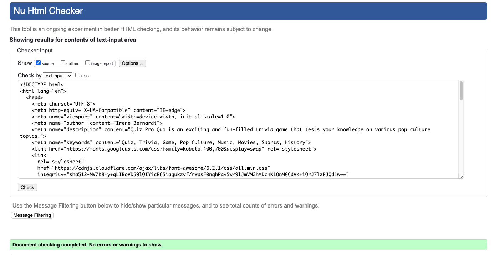

* [game.html](game.html) - Passed.
  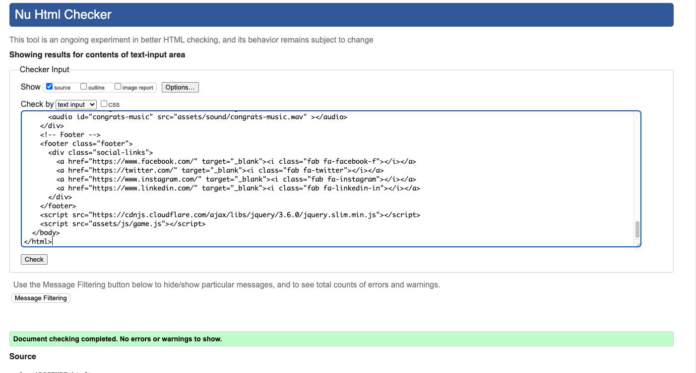

* [leaderboard.html](leaderboard.html) - Passed.
  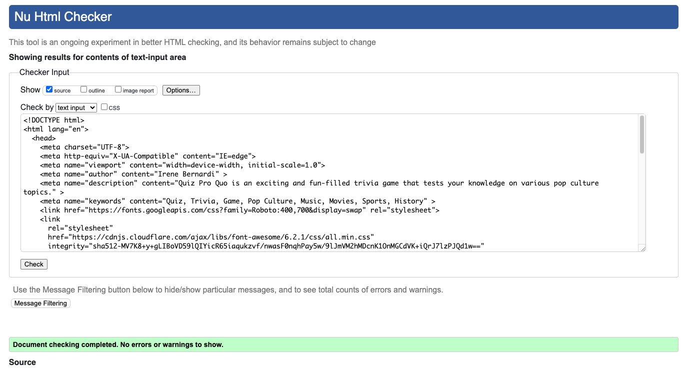

* [contact-form.html](contact-form.html) - Passed.
  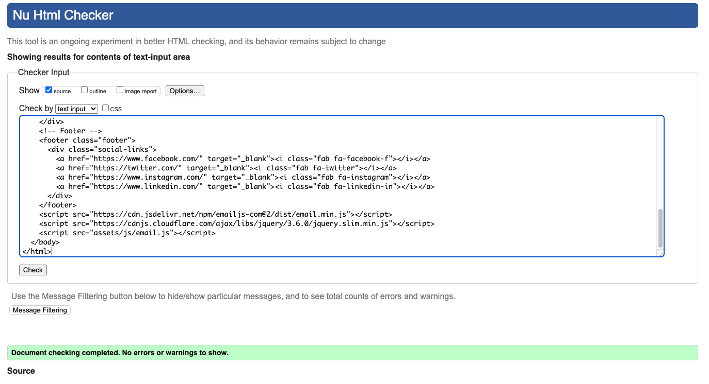

* [404.html](404.html) - Passed.
 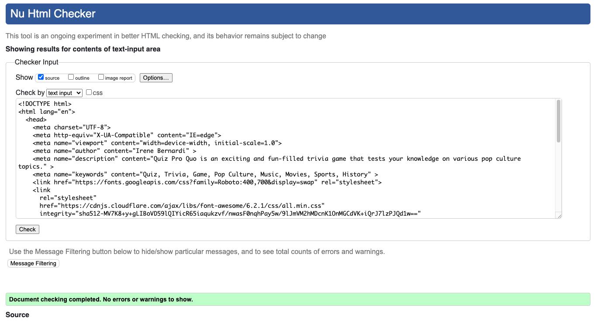

* [500.html](500.html) - Passed.
  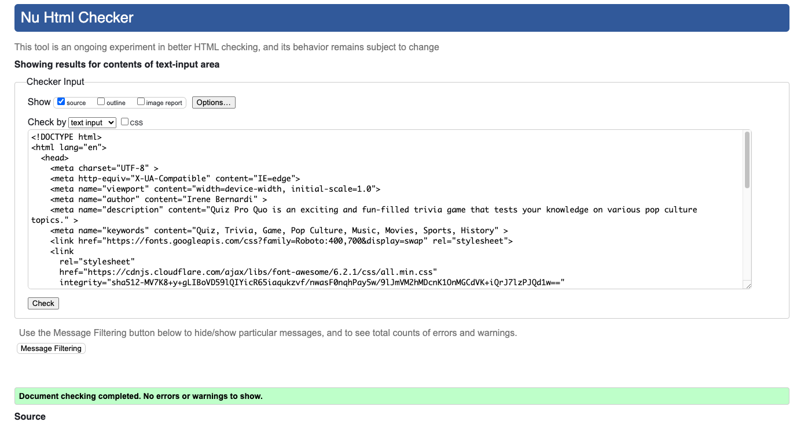

* [style.css](assets/css/style.css) - Passed, no errors found.
  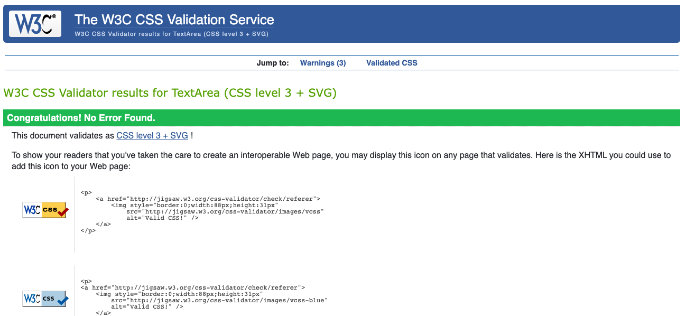

### JavaScript Validator
[jshint](https://jshint.com/) was used to validate the JavaScript.

* [script.js](assets/js/script.js) - Passed.
  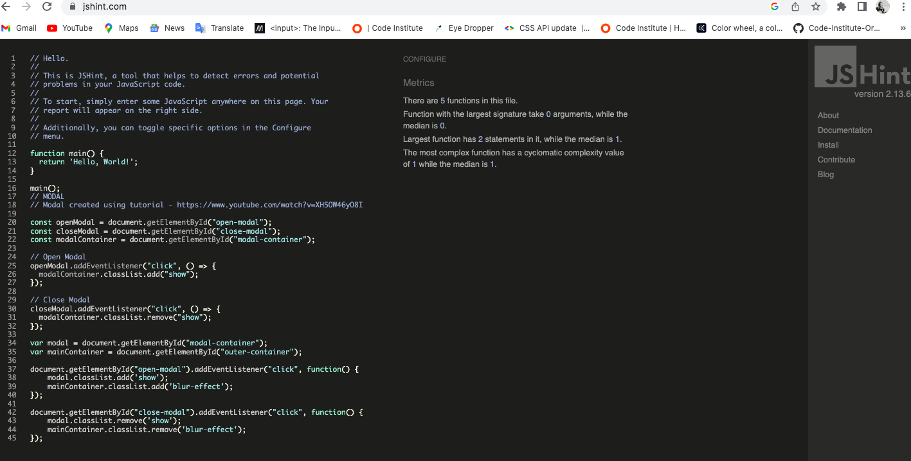

* [game.js](assets/js/game.js) - Passed.
  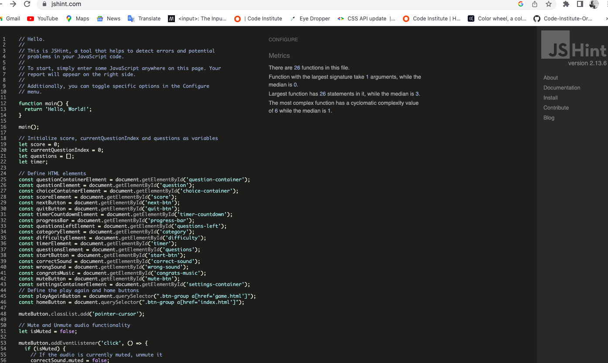

* [leaderboards.js](assets/js/leaderboard.js) - Passed.
  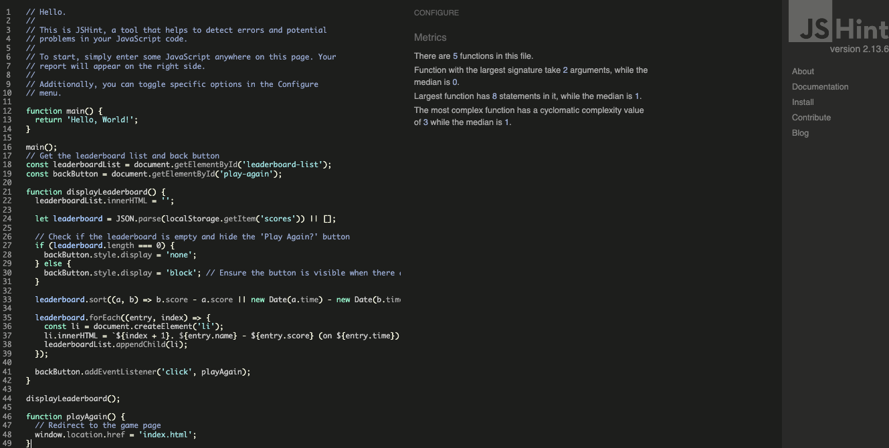

* [email.js](assets/js/email.js) - Passed.
  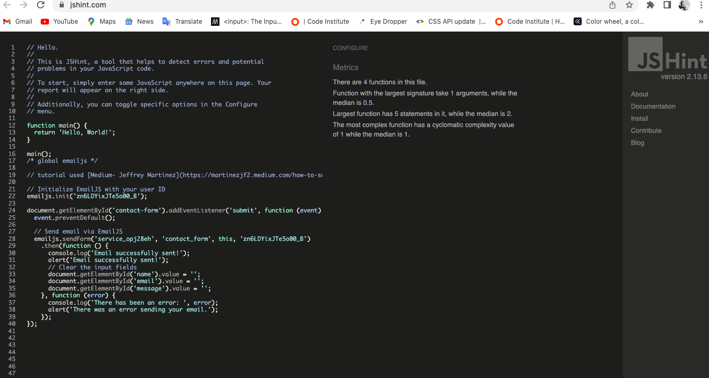

### Lighthouse
I utilized Chrome's Lighthouse tool to evaluate the website's performance, accessibility, adherence to best practices, and SEO optimization.

### Desktop Results
Every page scores a perfect 100 in the final two categories. Meanwhile, three pages boast scores exceeding 90 in the performance category.
* [Home Page](TESTING/Lighthouse/home-desk.png)
* [Game Page](TESTING/Lighthouse/game-desk.png)
* [Leaderboard Page](TESTING/Lighthouse/leaderboard-desk.png)
* [Contact Page](TESTING/Lighthouse/contact-form-desk.png)

### Mobile Results
Every page scores a perfect 100 in the final two categories. Meanwhile, three pages boast scores exceeding 90 in the performance category.
* [Home Page](TESTING/Lighthouse/home-mob.png)
* [Game Page](TESTING/Lighthouse/game-mob.png)
* [Leaderboard Page](TESTING/Lighthouse/leaderboard-mob.png)
* [Contact Page](TESTING/Lighthouse/contact-form-mob.png)

## Manual Testing

### Testing User Stories
`First Time Visitors`

| Goals   | How are they achieved?  |
|------------|------------|
| When I land on the Quiz Pro Quo homepage, I want to take part in a trivia quiz online and improve my general knowledge. I want to be able to play at any time, anywhere.   | Quiz Pro Quo sources general knowledge quiz questions from a broad spectrum of topics, akin to what a quiz app would offer. The platform is accessible for users at any time that suits their convenience.  |
| I want the site to be responsive to my device.    | I have developed the site with responsiveness in mind.  |
| I want the site to be easy to navigate.    | Buttons are used throughout the site for navigation, much like a mobile app. As the site is like a mobile app - Buttons are prevalent across the site, providing an experience akin to a mobile app. In aiming for an app-like feel, I opted against making it resemble a conventional webpage. Additionally, the page title serves as a link to the home page.   |

`Returning Visitors`

| Goals   | How are they achieved?  |
|------------|------------|
| I want to be able to choose a level of difficulty that I feel is appropriate for me, based on my experience from my first visit to the site.   | Users can choose their preferred level of difficulty and timer length, as well as the topic before starting the game. After completing a round, they have the flexibility to select a different level of difficulty, timer duration, or topic for their subsequent games.  |

`Frequent Visitors`

| Goals   | How are they achieved?  |
|------------|------------|
| I want to be able to adjust the difficulty level to keep improving my knowledge.   | Before starting the game, users can choose their desired level of difficulty. After completing a round, they have the option to adjust the difficulty for future games.  |
| I want to be able to log my high scores to see how I am performing.    | Users can record their top scores on the leaderboard page, which also showcases the scores of other players.  |

### Full Testing
Full testing was performed on the following devices:

* Laptop:
  * MacBook Air (13-inch, 2017)
* Mobile Devices:
  * iPhone 14 pro.
  * iPhone 13 pro.
  * iPhone 8.

Each device tested the site using the following browsers:
* Google Chrome
* Safari
* Firefox
* Edge
* Opera

Friends and family conducted further testing across various devices and screen sizes, and they encountered no issues during gameplay.

`Home Page`
| Feature | Expected Outcome | Testing Performed      | Result | Pass/Fail      |
|---------|-----------|------------|--------|--------------|
| The Sites title     | Link directs the user back to the home page   | Clicked title| 	Home page reloads  | Pass    |
| Game Rules button    | Displays the modal with the instructions on how to play the game   | Clicked on button| Modal with instructions on how to play opens  | Pass  |
| Modal close button    | Closes the modal |	Clicked on close button	| Modal closed |	Pass |
| Play Button	| Directs the user to the game page |	Clicked on button |	Game page opens to display the difficulty selections |	Pass          |
| Leaderboard button    | Directs the user to Leaderboard page   | Clicked on button | Directs to the Leaderboard page   | Pass   |
| All buttons - hover effect   | All light purple buttons with white text and teal color border should change to light teal with white text and purple color border when hovered over.   | Hover over each button on the page | Each button displayed the correct styling when hovered over  | Pass  |
| Reach Out button     | Directs the user to the Contact page, the page opens in a new tab    | Clicked on button | Contact page opens in separate tab | Pass |
| Footer and Social media icons     | Social media icons in the footer redirect to their respective platforms in a new tab.  | Clicked on each Social media icon | social media page opens in separate tab | Pass |

`Game Page - Difficulty, Category, Number of Questions and Time Selection`
| Feature | Expected Outcome | Testing Performed      | Result | Pass/Fail      |
|---------|-----------|------------|--------|--------------|
| The Sites | title	Link directs the user back to the home page	| Clicked title	| Directed back to home page	| Pass   |
| All buttons - hover effect   | All light purple buttons with white text and teal color border should change to light teal with white text and purple color border when hovered over.   | Hover over each button on the page | Each button displayed the correct styling when hovered over  | Pass  |
| Category Dropdown    | Check if category options are populated dynamically via JavaScript   | Clicked on category box | Dropdow list of all categories displays  | Pass |
| Difficulty Dropdown | Verify the options of Easy, Medium, and Hard | Clicked on difficulty box | Dropdow list of all difficulties displays  | Pass |  
| Questions Dropdown | Validate that user can choose between 5, 10, 15, and 20 questions | Clicked on Questions box | Dropdow list of Questions number displays  | Pass |  
| Difficulty Dropdown | Ensure difficulty dropdown options from Easy, Medium and Hard | Clicked on Difficulty box | Dropdow list of Easy, Medium and Hard options displays  | Pass |       
| Timer Dropdown | Ensure timer dropdown options from 5 to 30 seconds | Clicked on Timer box | Dropdow list of Timer lenght options displays  | Pass |     
| Footer and Social media icons     | Social media icons in the footer redirect to their respective platforms in a new tab.  | Clicked on each Social media icon | social media page opens in separate tab | Pass |

`Game Page - Quiz Area`
| Feature | Expected Outcome | Testing Performed      | Result | Pass/Fail      |
|---------|-----------|------------|--------|--------------|
| The Sites | title	Link directs the user back to the home page	| Clicked title	| Directed back to home page	| Pass   |
| All buttons - hover effect   | All light purple buttons with white text and teal color border should change to light teal with white text and purple color border when hovered over.   | Hover over each button on the page | Each button displayed the correct styling when hovered over  | Pass  |
| Start Quiz Button   | Quiz should start when the "Start Quiz" button is clicked.   | Clicked Start button | Game starts as expected   | Pass    |
| Next Question Button   | Display the next question when clicked after choosing an answer  | Answer Quiz question and clicked Next button | Next question displays   | Pass    |
| Timer Functionality   | The timer should countdown from the set time. When it reaches zero, the quiz should be automatically submitted.  | Start the quiz by pressing the "Start Quiz" button and observe the initial display of the timer, allow the timer to run until it reaches zero  | As soon as the timer hits zero, the quiz is automatically submitted   | Pass |
| Multiple Choice Selection   | User should be able to select only one option. When one option is clicked, any other option should be disabled.  | Clicked on one of the multiple choice options, confirmed that the chosen option is visibly selected. After selecting one option, tried to select another option.   | User can't select another option   | Pass |
| Correct/Incorrect Answer Colours   | The selected answer should be highlighted with the colour designated for correct answers, green for correct and red for incorrect.  | Navigate to a question. Select the known correct answer. Then select an answer that is known to be incorrect.   | The selected answer is highlighted with the colour designated for correct or incorrect answers   | Pass |
| Question populated    | Questions should fetch from the Open Trivia DB API based on the user's selected category, difficulty, and number of questions.   | Begin by choosing a specific category, difficulty, and number of questions. For example, select "Science: Computers", "Medium" difficulty, and "10" questions. Trigger the functionality in the application that requests questions from the API by starting the quiz. | Questions are displayed in the application's user interface. The questions match the selected category (e.g., questions are related to "Science: Computers"), the difficulty of the questions corresponds to the chosen difficulty level and the number of questions matches the user's selection (e.g., 10 questions). | Pass  |
| Mute Functionality     | Check if clicking the mute button mutes and unmutes the game sounds.   | Ensure that the device's volume is turned up and not on silent mode. Launch the game/application and ensure that the default game sounds are audible. Click or tap on the mute button. | The game sounds are immediately silenced upon clicking the mute button.  | Pass |
| Quit button  | The "Quit" button should prompt the user for confirmation. If confirmed, the game should redirect to index.html.   | Clicked the "Quit" button during gameplay.  If the user confirms quit the game immediately halt all gameplay processes and activities. Redirect or navigate the user to the index.html page. If the user declines the confirmation, the confirmation dialog closes and the game continues without any disruptions.      | Upon clicking the "Quit" button, a confirmation dialog/prompt appears, asking the user if they truly want to quit the game. | Pass |
| Footer and Social media icons     | Social media icons in the footer redirect to their respective platforms in a new tab.  | Clicked on each Social media icon | social media page opens in separate tab | Pass |
         

`Game Page - End of Quiz`
| Feature | Expected Outcome | Testing Performed      | Result | Pass/Fail      |
|---------|-----------|------------|--------|--------------|
| The Sites | title	Link directs the user back to the home page	| Clicked title	| Directed back to home page	| Pass   |
| All buttons - hover effect   | All light purple buttons with white text and teal color border should change to light teal with white text and purple color border when hovered over.   | Hover over each button on the page | Each button displayed the correct styling when hovered over  | Pass  |
| End of the Quiz    | The end screen should correctly display the user's score and a feedback message depending on the score achieved.   | Completed all the questions in the quiz | End screen correctly showcases the total score achieved by the user and a feedback message  | Pass  |
| Play again? button	| Clicking on this button will return you to the start of the game page where you can select the quiz topic, number of questions, timer lenght and difficulty levels |	Clicked on the play again? button	| Directed to the beginning of the game to select the quiz topic, number of questions, timer lenght and difficulty levels	| Pass |
Home button	| Clicking on this button will take you back to the home page	| Clicked the home button	| Directed back to the home page	| Pass |
| Footer and Social media icons     | Social media icons in the footer redirect to their respective platforms in a new tab.  | Clicked on each Social media icon | social media page opens in separate tab | Pass |

`Leaderboard Page`
| Feature | Expected Outcome | Testing Performed      | Result | Pass/Fail      |
|---------|-----------|------------|--------|--------------|
| The Sites | title	Link directs the user back to the home page	| Clicked title	| Directed back to home page	| Pass   |
| All buttons - hover effect   | All light purple buttons with white text and teal color border should change to light teal with white text and purple color border when hovered over.   | Hover over each button on the page | Each button displayed the correct styling when hovered over  | Pass  |
| Score Displayed   | If there are scores saved in the local storage, they should be listed in descending order based on the score. For scores with the same value, they are sorted based on the time. Each entry displays rank, name, score, and time.   | Completed all the questions in the quiz, entered name in Leaderboard after completing the game | Page loads without errors, each entry displays rank, name, score, and time  | Pass  |
| Play again? button hidden	| 'Play Again?' button is hidden when the leaderboard list is empty. |	Cleared local storage manually and open Leaderboard Page	| The leaderboard list is empty and 'Play Again?' button is hidden.	| Pass |
| Play again? button	| Clicking on this button will return you to the start of the game page where you can select the quiz topic, number of questions, timer lenght and difficulty levels |	Clicked on the play again? button	| Directed to the beginning of the game to select the quiz topic, number of questions, timer lenght and difficulty levels	| Pass |
Home button	| Clicking on this button will take you back to the home page	| Clicked the home button	| Directed back to the home page	| Pass |
| Footer and Social media icons     | Social media icons in the footer redirect to their respective platforms in a new tab.  | Clicked on each Social media icon | social media page opens in separate tab | Pass |

`404 Error Page`
| Feature | Expected Outcome | Testing Performed      | Result | Pass/Fail      |
|---------|-----------|------------|--------|--------------|
| The Sites | title	Link directs the user back to the home page	| Clicked title	| Directed back to home page	| Pass   |
| 404 Error message    | 404 Error message ("[404 error]") is visible and appropriately sized   | Manually entered a wrong URL on the website. | 404 Error message ("[404 error]") is visible and appropriately sized. The "Go back Home" link is visible and correctly styled and the descriptive message ("Oops! The page you're looking for must have gone on vacation.") is clear and readable.   | Pass   |
"Go back Home" link 	| Clicking on this link will take you back to the home page	| Clicked the home link	| Directed back to the home page	| Pass |
| Footer and Social media icons     | Social media icons in the footer redirect to their respective platforms in a new tab.  | Clicked on each Social media icon | social media page opens in separate tab | Pass |

`500 Error Page`
| Feature | Expected Outcome | Testing Performed      | Result | Pass/Fail      |
|---------|-----------|------------|--------|--------------|
| The Sites | title	Link directs the user back to the home page	| Clicked title	| Directed back to home page	| Pass   |
| 500 - Internal Server Error message    | 500 Internal Server Error message is visible and appropriately sized     | Caused a syntax error in the server-side script by omitting a semicolon at the end of a statement or use undeclared variables. | 500 Internal Server Error message ("[500 - Internal Server Error]") is visible and appropriately sized. The "Go back Home" link is visible and correctly styled and the descriptive message ("Oops! Something went wrong.") is clear and readable.   | Pass    |
"Go back Home" link 	| Clicking on this link will take you back to the home page	| Clicked the home link	| Directed back to the home page	| Pass |
| Footer and Social media icons     | Social media icons in the footer redirect to their respective platforms in a new tab.  | Clicked on each Social media icon | social media page opens in separate tab | Pass |
