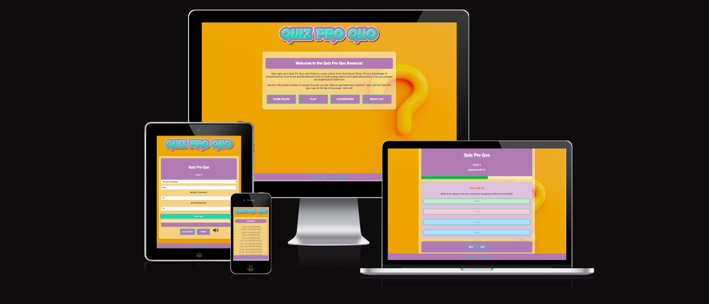
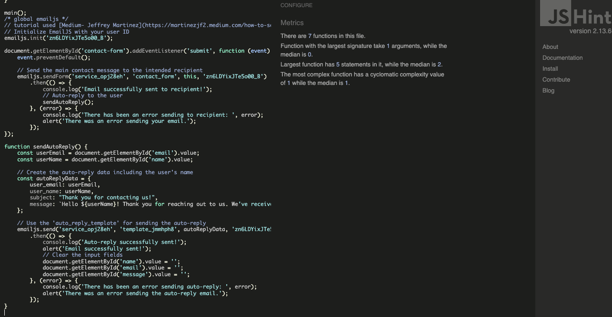

# Quiz Pro Quo - Testing

Find the final project here: [Quiz Pro Quo](https://irebernardidev.github.io/Quiz-Pro-Quo/)

## Contents

- [Automated Testing](#automated-testing)
  * [W3C Validator](#w3c-validator)
  * [Javascript Validator](#javascript-validator)
  * [Lighthouse](#lighthouse)
- [Manual Testing](#manual-testing)
  * [Testing User Stories](#testing-user-stories)
  * [Full Testing](#full-testing)

Throughout the entire development process, I extensively used Chrome Developer Tools for real-time testing and troubleshooting. I leveraged its console feature to ensure JavaScript code functionality and identify any issues.

To verify adaptability, I employed Google Chrome Developer Tools and Firefox's Inspector tool to check the responsiveness of each page across various devices and screen sizes. This rigorous approach ensured a seamless user experience on multiple platforms.

## Automated Testing

### W3C Validator
[W3C](https://validator.w3.org/) was used to validate the HTML on all pages of the website. It was also used to validate the CSS.

* [index.html](index.html) - Passed.
  

* [game.html](game.html) - Passed.
  

* [leaderboard.html](leaderboard.html) - Passed.
  

* [contact-form.html](contact-form.html) - Passed.
  

* [404.html](404.html) - Passed.
 

* [500.html](500.html) - Passed.
  

* [style.css](assets/css/style.css) - Passed, no errors found.
  

### JavaScript Validator
[jshint](https://jshint.com/) was used to validate the JavaScript.

* [script.js](assets/js/script.js) - Passed.
  

* [game.js](assets/js/game.js) - Passed.
  

* [leaderboards.js](assets/js/leaderboard.js) - Passed.
  

* [email.js](assets/js/email.js) - Passed.
  

### Lighthouse
I utilized Chrome's Lighthouse tool to evaluate the website's performance, accessibility, adherence to best practices, and SEO optimization.

### Desktop Results
Every page scores a perfect 100 in the final two categories. Meanwhile, three pages boast scores exceeding 90 in the performance category.
* [Home Page](TESTING/Lighthouse/home-desk.png)
* [Game Page](TESTING/Lighthouse/game-desk.png)
* [Leaderboard Page](TESTING/Lighthouse/leaderboard-desk.png)
* [Contact Page](TESTING/Lighthouse/contact-form-desk.png)

### Mobile Results
Every page scores a perfect 100 in the final two categories. Meanwhile, three pages boast scores exceeding 90 in the performance category.
* [Home Page](TESTING/Lighthouse/home-mob.png)
* [Game Page](TESTING/Lighthouse/game-mob.png)
* [Leaderboard Page](TESTING/Lighthouse/leaderboard-mob.png)
* [Contact Page](TESTING/Lighthouse/contact-form-mob.png)

## Manual Testing

### Testing User Stories

